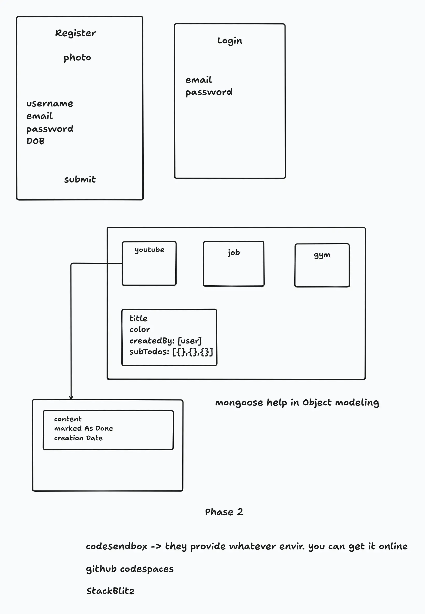

# Back End with JavaScript

# Express

## Models
- Mongoose
- How to store data and what data is to store -> moon modeler(data ka structure)
- eraser.io used as data modeling tool

Data modelling -> what data points do i have to collect from the user

## Youtube Backend

dependency ->
- npm i dotenv
- npm i express
- npm i -D prettier

### Database connection
- npm i mongoose
- npm i -D nodemon

- We use mongoDb Atlas to connect our database to the backend.

- npm i cors
- npm i cookie-parser
- npm i mongoose-aggregate-paginate-v2
- npm i bcrypt // password hashing
- npm i jsonwebtoken // for authentication

cloudinary -> for image upload
- npm i cloudinary

- npm i multer 
- express-fileupload and multer but we use multer for image upload.

## HTTP {Hyper Text Transfer Protocol}

url, uri, urn
- what are HTTP headers
- metadata --> key-value sent along with request & response
- use of headers -> caching, authentication, manage state
`X-prefix -----> 2012 (X- deprecated)`
- Request Headers -> from Client
- Response Headers -> from Server
- Representation Headers -> encoding/ compression (gzip file, graph charts)
- Payload Headers -> data

### Most Common Headers
- Accept: application/json
- User-Agent
- Authorization: Bearer token
- Content-Type
- Cookie
- Cache-Control
### CORS
- Access-Control-Allow-Origin
- Access-Control-Allow-Credentials
- Access-Control-Allow-Method
### Security
- Cross-Origin-Embedder-Policy
- Cross-Origin-Opener-Policy
- Content-Security-Policy
- X-XSS-Protection

### HTTP Methods
 Basic set of operations that can be used to interact with server.
- GET: retrieve a resource
- HEAD: No message body (response headers only)
- OPTIONS: what operations are available
- TRACE: loopback test (get same data)
- DELETE: remove a resource
- PUT: replace a resource
- POST: interact with resource (mostly add)
- PATCH: change part of a resource

### HTTP Status Code
- 1xx: Informational
- 2xx: Success
- 3xx: Redirection
- 4xx: Client error
- 5xx: Server error

100 Continue             400 Bad request
102 Prcessing            401 Unauthorized 
200 OK                   402 Payment Required
201 created              404 Not found
202 accepted             500 Internal Server Error
307 temporary redirect   504 Gate way TimeOut
308 permanent redirect  

- create user router and conroller
- Access Token - usually short lived (15 mins) for authentication
- Refresh Token - usually long lived (7 days) hit the end point to get refresh token and match with the database refresh token and then generate new access token or send to the user.

- designing login controllers
- create auth middleware to protect the routes
- designing logout controllers
